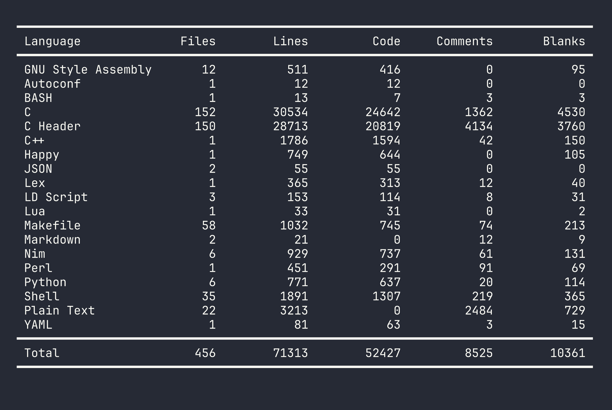

# Znu

# Used Languages

**Znu** is a SMP-capable, modular semi-POSIX compliant kernel implementation in C, mainly for the x86_64 architecture.

The project was started as me asking a question: "What if i read the OSDev Wiki and tried to make an operating system?" and started developing Znu around mid-April of 2026.

After 5 months (as of writing), Znu currently implements these features:
- GDT, IDT, (IO)APIC, 

